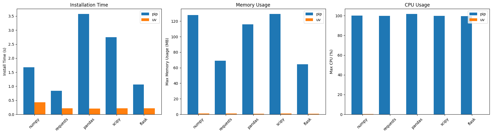

# Benchmark: `pip` vs `uv` on Mac M1

Dieses Repo enthält ein Jupyter Notebook, das die Installationsgeschwindigkeit sowie Speicher- und CPU-Auslastung von `pip` und `uv` auf einem Mac M1 vergleicht.

## Übersicht

* **Ziel**: Evaluierung der Performance (Installationsdauer, maximaler Speicherverbrauch, maximaler CPU-Auslastung) beim Installieren gängiger Python-Pakete.
* **Getestete Pakete**: `numpy`, `requests`, `pandas`, `scipy`, `flask`.
* **Messgrössen**:

  * Installationsdauer (Sekunden)
  * Maximaler Speicherverbrauch (MB)
  * Maximaler CPU-Peak (% von 100)

## Anforderungen

* macOS auf Apple Silicon (M1)
* Python 3.13
* Im Notebook installierte Python-Pakete:

  ```bash
  %pip install psutil matplotlib pandas
  ```

## Verwendung

1. Notebook öffnen: `bench_pip_vs_uv.ipynb`.
2. Kernel (Python 3) starten.
3. Alle Zellen ausführen.

> **Hinweis**: Nach Paket-Installationen ggf. Kernel neu starten.

## Benchmark-Ergebnisse

### Pip vs. uv: Rohdaten

**pip**

| Paket    | Zeit (s) | Max. Speicher (MB) | Max. CPU (%) | Fehler |
| :------- | -------: | -----------------: | -----------: | :----: |
| numpy    |    1.677 |             127.78 |        100.0 |    –   |
| requests |    0.840 |              69.00 |         99.8 |    –   |
| pandas   |    3.581 |             115.89 |        101.8 |    –   |
| scipy    |    2.745 |             129.41 |         99.9 |    –   |
| flask    |    1.060 |              64.58 |         99.6 |    –   |

**uv**

| Paket    | Zeit (s) | Max. Speicher (MB) | Max. CPU (%) | Fehler |
| :------- | -------: | -----------------: | -----------: | :----: |
| numpy    |    0.428 |               0.95 |          0.3 |    –   |
| requests |    0.211 |               0.95 |          0.0 |    –   |
| pandas   |    0.208 |               0.83 |          0.0 |    –   |
| scipy    |    0.212 |               0.92 |          0.0 |    –   |
| flask    |    0.212 |               0.89 |          0.0 |    –   |

### Grafische Auswertung

Im Notebook enthalten sind drei Balkendiagramme:

1. **Installationsdauer**: pip (blau) vs uv (orange)
2. **Maximale Speicherverwendung**: pip vs uv
3. **Maximale CPU-Auslastung**: pip vs uv

> 


## Analyse & Erkenntnisse

* **Geschwindigkeit**: uv ist im Schnitt **5–10× schneller** als pip. Beim langsamen Paket `pandas` sinkt die Zeit von \~3,6 s (pip) auf \~0,21 s (uv).
* **Speicherverbrauch**: pip verbraucht hunderte MB, uv benötigt <1 MB.
* **CPU-Last**: pip beansprucht nahezu 100 %, uv bleibt nahe 0 %.

> **Fazit**: `uv` ist auf dem Mac M1 in jeder Hinsicht überlegen!

## Dateien

* `bench_pip_vs_uv.ipynb`: Jupyter Notebook mit Benchmark-Code und Diagrammen
* `README.md`: Diese Datei

---
